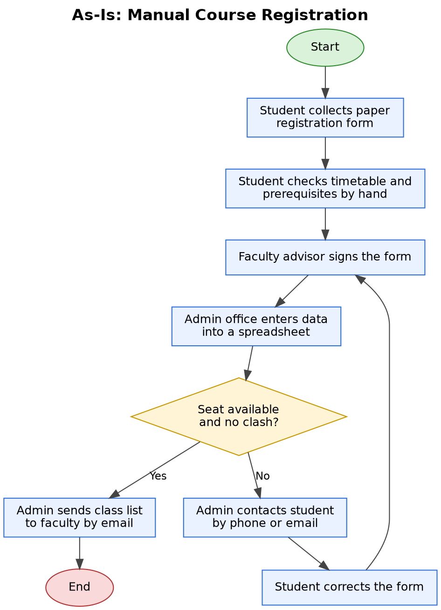
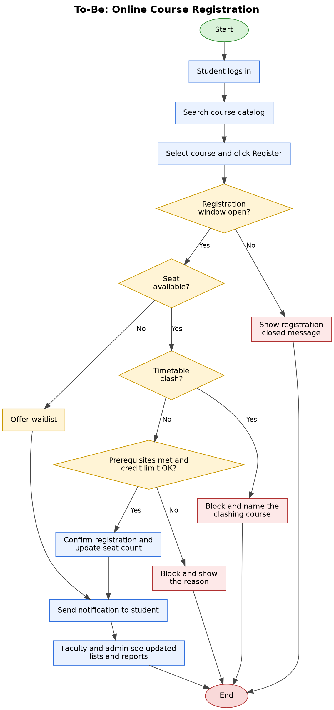

# 4. Process Flows

## 4.1 As-Is (manual process)

**Steps:**
1. Student collects a paper registration form.
2. Student checks the timetable and prerequisites by hand.
3. Faculty advisor signs the form.
4. Admin office enters the data into a spreadsheet.
5. If a seat is unavailable or there is a clash, admin contacts the student by phone or email, the student corrects the form, and it goes back for signature.
6. If everything is fine, admin sends the class list to faculty by email.

## 4.2 To-Be (proposed system)

**Steps:**
1. Student logs in and searches the course catalog.
2. Student selects a course and clicks Register.
3. The system checks, in order: registration window, seat availability, timetable clash, prerequisites and credit limit.
4. If a check fails, the system blocks the registration and shows the reason. If the course is full, the student is offered the waitlist.
5. If all checks pass, the system confirms the registration and updates the seat count.
6. The student is notified, and faculty and admin see updated lists and reports in real time.

## 4.3 Key differences
| Step | As-is | To-be |
|---|---|---|
| Checks | Done by hand, found late | Automatic at submission |
| Communication | Phone and email | Instant notification |
| Class lists | Emailed by admin | Real-time faculty view |
| Record keeping | Spreadsheet | Central audit log |
