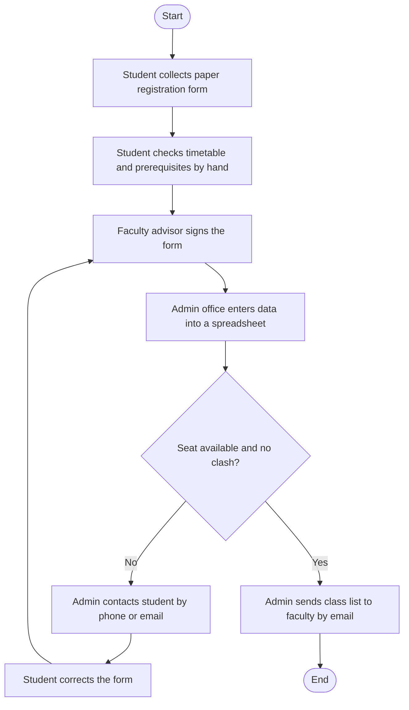
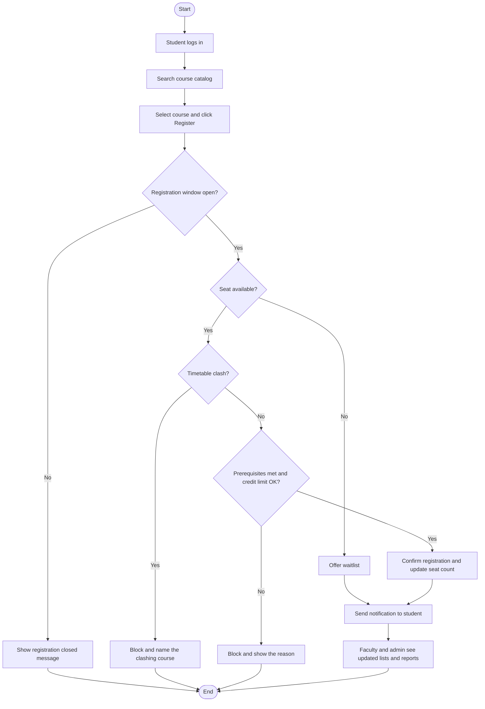

# 4. Process Flows

Diagrams are written in Mermaid and render automatically on GitHub.

## 4.1 As-Is (manual process)

## 4.2 To-Be (proposed system)

## 4.3 Key differences
| Step | As-is | To-be |
|---|---|---|
| Checks | Done by hand, found late | Automatic at submission |
| Communication | Phone and email | Instant notification |
| Class lists | Emailed by admin | Real-time faculty view |
| Record keeping | Spreadsheet | Central audit log |
